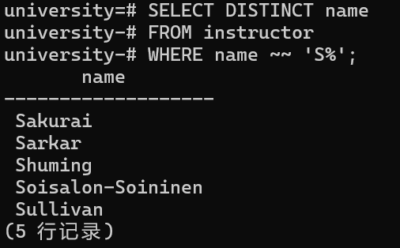

# Lab SQL

<font size="5">42233063-数据科学与大数据技术-韩璐帆</font>


## 题目一（3分+1分）

> **需要**使用PostgreSQL及DataGrip软件操作，并对操作页面及结果进行截图。

1. 新建一个`university`数据库，并执行`largeRelationsInsertFile.sql`，导入数据。
- 新建`university`数据库


- 连接`university`数据库


- 导入SQL


- 配置数据源


- 运行结果


2. 运行第2次作业的题目三代码。注意：把原题目中的`会计`改成`History`。
- 新建查询控制台


- 运行代码   


- 查询结果为空      


## 题目二（3分）

参考[Pattern Matching](https://www.postgresql.org/docs/17/functions-matching.html)，在PG中使用至少三种方法实现找到所有以`S`开头教师的名字。
```sql
--法1：like操作
SELECT DISTINCT name
FROM instructor
WHERE name LIKE 'S%';
```  
```sql
--法2：~~操作
SELECT DISTINCT name
FROM instructor
WHERE name ~~ 'S%';
```  
```sql
--法3：similar to
SELECT DISTINCT name
FROM instructor
WHERE name SIMILAR TO 'S%';
```
```sql  
--法4：提取字符
SELECT DISTINCT name
FROM instructor
WHERE substr(name, 1, 1) = 'S';
```
- 查询结果


## 题目三（3分）

`psql`是PostgreSQL的命令行工具。请使用`psql`命令行工具：

- 实现题目二
```sql 
--法1：like操作
university=# SELECT DISTINCT name
university-# FROM instructor
university-# WHERE name LIKE 'S%';
```


```sql 
--法2：~~操作
university=# SELECT DISTINCT name
university-# FROM instructor
university-# WHERE name ~~ 'S%';
```


```sql 
--法3：similar to
university=# SELECT DISTINCT name
university-# FROM instructor
university-# WHERE name SIMILAR TO 'S%';
```


```sql 
--法4：提取字符
university=# SELECT DISTINCT name
university-# FROM instructor
university-# WHERE substr(name, 1, 1) = 'S';
```


- 列出所有的数据库
```
Server [localhost]:
Database [postgres]:
Port [5432]:
Username [postgres]:
用户 postgres 的口令：
psql (17.4)
输入 "help" 来获取帮助信息.
postgres=# \l
```


- 列出当前数据库的所有表
```
postgres=# \c university
您现在已经连接到数据库 "university",用户 "postgres".
university=# \dt
```


- 显示某张表的关系模式
```
university=# \d instructor
```


